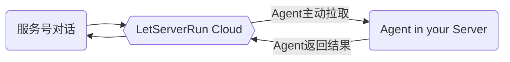

## 基本概念



## 关注微信服务号

在文档首页有二维码了，这里再贴一次吧，如果关注了请继续后边的步骤。


关注后，输入`help`或者`帮助`看看一切是否正常。  

## 第一个 Agent

通过命令`agent add 它的名字`增加一个 Agent。  
通过`status`命令，可以看到你加的这个 Agent 在离线状态。一个 Agent 如果三分钟以上没有心跳就会离线。  

我们先使用一个[开源的通用 Agent](https://github.com/hack-fan/skadi-agent-shell)来上手。  
它可以帮你在服务器执行特定的命令。后面我们可以根据需求，自己通过 API 或 SDK，集成 Agent 或自己编写。

假设你的服务器是 Debian/Ubuntu ,如果是别的请参考 [安装通用Agent](/docs/basic/common-agent/)  
如果您本身就是 root 用户，麻烦去掉所有命令中的 `sudo`

```bash
# 注册仓库
curl -1sLf \
  'https://dl.cloudsmith.io/public/hackfan/skadi/setup.deb.sh' \
  | sudo -E bash
# 更新
sudo apt update
# 安装
sudo apt install skadi
```

在安装后，因为还没有 Token，所以并没有自动启动。
我们用 skadi 把之前公众号添加 Agent 得到的 Token 写入配置文件。
你也可以编辑 `/etc/skadi/skadi.yml` 这个文件自己写入。

```bash
# 写入 Token
sudo skadi AGENT-TOKEN
# 启动服务
sudo systemctl start
```

## 试用 Agent

在公众号输入 `它的名字 help`

## 主动发送通知

除了您在公众号发命令让 Agent 代为执行并返回结果这一功能，我们当然还有让您主动调用 API 往公众号发通知的功能。您可以在服务号发送 `token` 命令查看自己的 token 。

使用用户 token，您就可以用 API 向公众号发警告消息了：

```http
GET https://api.letserver.run/message/info?token=YOUR-TOKEN&msg=hello
```

这个 GET 接口是为了调试和轻量使用场景的，在程序中使用的话有更完善的 POST 接口，未来 SDK 也会支持主动发消息。
