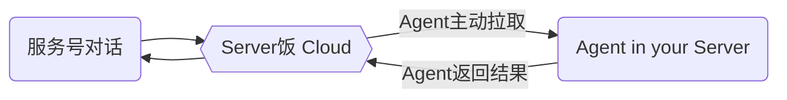

## 基本概念



## 关注微信服务号

在文档首页有二维码了，这里再贴一次吧，如果关注了请继续后边的步骤。


关注后，输入`help`或者`帮助`看看一切是否正常。  

## 第一个 Agent

通过命令`agent add 它的名字`增加一个 Agent。  
通过`status`命令，可以看到你加的这个 Agent 在离线状态。一个 Agent 如果三分钟以上没有心跳就会离线。  

我们先使用一个[开源的通用 Agent](https://github.com/hack-fan/skadi-agent-shell)来上手。  
它可以帮你在服务器执行特定的命令。后面我们可以根据需求，自己通过 API 或 SDK，集成 Agent 或自己编写。

假设你的服务器是 Debian/Ubuntu ,如果是别的请参考 [安装通用Agent](/docs/basic/common-agent/)  
如果您本身就是 root 用户，麻烦去掉所有命令中的 `sudo`

```bash
# 注册仓库
curl -1sLf \
  'https://dl.cloudsmith.io/public/hackfan/skadi/setup.deb.sh' \
  | sudo -E bash
# 更新
apt update
# 安装
apt install skadi
```

在安装后，因为还没有 Token，所以并没有自动启动。
我们用 skadi 把之前公众号添加 Agent 得到的 Token 写入配置文件。
你也可以编辑 `/etc/skadi/skadi.yml` 这个文件自己写入。

```bash
# 写入 Token
sudo skadi AGENT-TOKEN
# 启动服务
sudo systemctl start
```

只有第一次需要手动启动服务

## 试用 Agent

在公众号输入 `它的名字 help` ，在一分钟之内，命令会被Agent拉走并返回结果。  
这个官方的通用 Agent 功能由 `/etc/skadi/skadi.yml` 这个配置文件定义。

然后你可以顺次输入`名字 date`,`名字 lsroot`,`名字 free -m`,`名字 Hi Fool`,
去试用，接下来，更改配置文件就可以完成重启服务，查看状态等简单的动作了。

```yaml
# 调试模式，打开可以看到更多日志，使用 journalctl -u skadi 查看日志
debug: false
# 可以直接填写token到这里，或者用 skadi TOKEN 命令去写入
token:
# shortcuts 将一个单词精确的翻译为一条命令
# short: 你在公众号输入的消息
# dir: 命令的工作目录，可选。有的命令不需要工作目录就不填。
# cmd: 精确的命令。
shortcuts:
  - short: date
    cmd: "date --rfc-3339=second"
  - short: lsroot
    dir: /
    cmd: ls
# commands 是一个命令白名单，这里列出命令，在公众号使用时可以随意加参数。
# dir: 命令的工作目录，可选。有的命令不需要工作目录就不填。
# prefix: 允许的命令，比如这里允许free，实际使用时可以输入 free -k
commands:
  - prefix: free
# templates 是一个模板引擎，可以预留参数，调用时只用输入参数
# name: 调用时接在 Agent 名称后的第一个词
# dir: 命令的工作目录，可选。有的命令不需要工作目录就不填。
# temp: 模板，用的 golang 的模板引擎
# 示例 name:"Hi" temp:"echo I am not %s!"
# 在公众号输入 [Hi 傻瓜] 会收到结果 [I am not 傻瓜!]
templates:
  - name: Hi
    temp: "echo I am not %s!"
```

修改完配置文件后，用命令重启服务，它们就生效了。

```bash
sudo systemctl restart skadi
```

## 编写自己的 Agent

你可以根据我们公开的 API 和 SDK 用各种语言编写自己的 Agent  
或者直接在服务中集成一个 Agent 实例，就可以把微信当作简单的业务控制台了。

## 额外功能 主动发送通知

除了在公众号发命令让 Agent 代为执行并返回结果这一功能，我们当然还有让您主动调用 API 往公众号发通知的功能。您可以在服务号发送 `token` 命令查看自己的用户 token 。

使用用户 token，您就可以用 API 向公众号发警告消息了：

```bash
curl "https://api.letserver.run/message/info?token=YOUR-TOKEN&msg=hello"
```

这个 GET 接口是为了调试和轻量使用场景的，在程序中使用的话有更完善的 POST 接口，SDK 也支持主动发消息。
