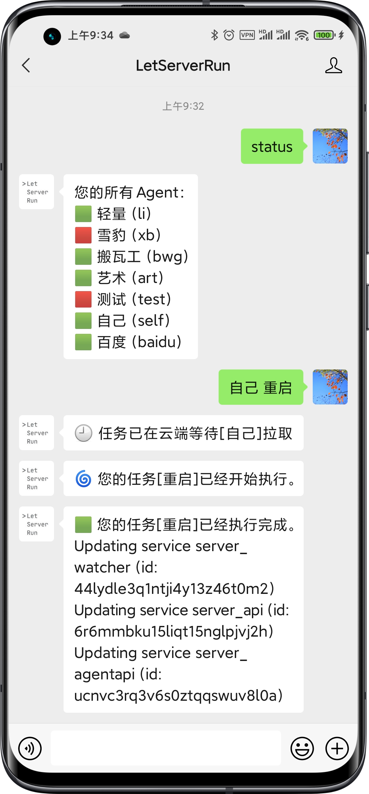

感谢你能来到这里，查看 LetServerRun 的文档。这个小服务适合个人、独立开发者或者小团队简单管理自己的服务器或云端服务。
在国内用微信真的很方便，也不用装什么别的 App，目前只能把我们的服务号`LetServerRun`当作控制台。

## 直观印象

右侧有一张使用截图

所以它的原理大概是这样:

1. 与公众号对话发送指令
2. 云端分拣和暂存
3. Agent 拉取指令并执行返回结果
4. 公众号回复你执行结果

## 一些特性

- 发送消息给 Agent 并追踪结果
- 通过 API 在公众号给自己发提醒
- 内网穿透
- 核心部分开源
- 绝对的安全，Agent 的能力只由您控制

## 开始吧

您需要关注我们的公众号，把它当作一个`Terminal`使用，输入`help`或者`帮助`查看命令。

然后跟着[快速开始](/docs/getting-started/)去部署一个 Agent, 或者直接查看文档编写自己的 Agent.
